# BTC多因子择时策略

## 项目概览

本项目旨在构建并分析一系列经过工程化处理的量化交易因子，这些因子涵盖了市场趋势、动量、波动率以及成交量等多个维度。所有因子均经过动态标准化处理，使其更适用于中低频交易场景下的多因子投资组合构建。项目共包含8个核心因子。

**作者：** 尹美珊 (学号：224040173)
**数据源：** 币安平台

## 项目文件结构说明

本项目的代码和数据存放说明：
my_project/
│
├── backtest/                     # 存放因子回测结果的子文件夹
│   ├── all_factor_backtest.dos   # 所有筛选因子合并后的整体策略回测结果
│   ├── 因子1.dos                 # 单独因子1的回测结果
│   ├── 因子2.dos                 # 单独因子2的回测结果
│   ├── 因子3.dos                 # 单独因子3的回测结果
│   ├── 因子4.dos                 # 单独因子4的回测结果
│   ├── 因子5.dos                 # 单独因子5的回测结果
│   ├── 因子6.dos                 # 单独因子6的回测结果
│   ├── 因子7.dos                 # 单独因子7的回测结果
│   └── 因子8.dos                 # 单独因子8的回测结果
│
├── result/                       # 存放回测结果相关的可视化图表
│   └── ... (包含各类图表文件，如因子表现图、组合策略净值曲线等)
│
├── BTCUSDT_1h.parquet            # 原始数据文件：BTCUSDT 1小时频率的行情数据 (Parquet格式)
├── factor_cal.dos                # 因子计算脚本/程序 (DOS/可执行文件)
├── factor_correlation.ipynb      # 计算各因子之间相关性的Jupyter Notebook文件
├── LICENSE                       # 项目许可证文件
└── README.md                     # 项目说明文件 (即本文档)

### 文件夹说明：

* **`backtest/`**：
    * 此文件夹包含了对项目中构建的各个因子进行独立回测，以及将筛选后的因子合并成最终策略进行整体回测所产生的详细结果。
    * 文件名如 `因子N.dos` 代表第N个因子的回测报告或数据。
    * `all_factor_backtest.dos` 是合并策略的回测报告或数据。
    * *(注：`.dos` 文件是dolphin db)*

* **`result/`**：
    * 该文件夹主要存放由回测分析产生的可视化图表。

### 根目录文件说明：

* **`BTCUSDT_1h.parquet`**：
    * 比特币对USDT交易对的1小时级别历史行情数据，采用Parquet格式存储。

* **`factor_cal.dos`**： (或 `factor_cal.py` / `.ipynb`，根据实际情况调整)
    * 此文件是用于计算项目中定义的8个因子的核心脚本或程序。

* **`factor_correlation.ipynb`**：
    * 计算和分析各个因子之间相关性的代码。

* **`LICENSE`**：
    * 说明了本项目代码和研究成果的使用许可条款。

* **`README.md`**：
    * 即您当前阅读的这份文件，提供了项目的整体介绍、研究方法、因子说明、文件结构等信息。

## 数据说明与预处理

### 数据来源与特征
* **数据下载平台：** 币安 (Binance)
* **交易品种：** 比特币 (BTC) 单品种择时分析
* **数据频率：** 1小时 (1h)
* **时间区间：** 2017年 - 2024年

### 数据预处理方法
1.  **空值处理：** 缺失值统一填补为0。这种处理方式的依据是：因子值的缺失多数情况下是由于计算基于移动窗口，导致回看期数据量不足。在此情况下，将缺失值视为中性信号（即不调仓），填充为0是相对合理的选择。
2.  **异常值过滤：** 采用3σ原则（三倍标准差）剔除数据集中的离群点，以减少极端异常值对因子表现和模型稳定性的影响。
3.  **同步校验：** 确保所有用于分析的加密货币品种（尽管本项目主要聚焦BTC）在时间戳上严格对齐，避免因时间不同步导致的数据分析偏差。

## 因子工程与分类解析

本项目共构建了八个量化因子，这些因子被归纳为四大类别：趋势类、动量类、波动率类和成交量类。

**关于趋势类与动量类因子的划分：**
将趋势类因子与动量类因子分开进行考察，是基于对因子间相关性矩阵的分析结果。通常而言，趋势投资策略侧重于跟随已经确认的市场方向，而动量投资策略则可能更关注价格变动的速度和强度。

### 一、趋势类因子 (Trend Factors)

| 因子编号 | 因子名称       | 核心逻辑                                                                 |
| :------- | :------------- | :----------------------------------------------------------------------- |
| Factor1  | 振幅差异因子   | 计算高收盘价（排序后）前25%交易日与后25%交易日的平均振幅之差，旨在捕捉极端行情下的波动特征。 |
| Factor2  | BIAS偏离度因子 | 衡量当前价格与其简单移动平均线（SMA）的相对位置，用以反映短期趋势的强度和可能的反转信号。   |
| Factor5  | RSI修正因子    | 对传统相对强弱指标（RSI）进行改进，将其值域标准化至\[-50, 50]区间，特别强化了对多头信号的识别能力。 |

### 二、动量类因子 (Momentum Factors)

| 因子编号 | 因子名称         | 核心逻辑                                                                       |
| :------- | :--------------- | :----------------------------------------------------------------------------- |
| Factor3  | MACD标准化因子   | 基于常用的12周期EMA、26周期EMA和9周期EMA构建的MACD指标，对其柱状图（Histogram）进行标准化处理，以捕捉中期趋势的动能变化。 |
| Factor4  | 12小时动量因子   | 计算120周期（对应12小时）的动量指标，并对其进行64周期的标准化处理，目的是突出短期价格趋势的持续性。        |
| Factor6  | 蜘蛛网策略因子   | 综合评估多个不同周期的指数移动平均线（EMA）的排列形态（多头/空头排列）并进行评分，结合当前价格在通道中的位置进行加权，用以识别通道突破的交易机会。 |

### 三、波动率类因子 (Volatility Factors)

| 因子编号 | 因子名称       | 核心逻辑                                                                       |
| :------- | :------------- | :----------------------------------------------------------------------------- |
| Factor7  | 网格交易因子   | 利用平均真实波幅（ATR）构建动态的网格交易通道，其因子得分结合了当前价格在网格中的位置以及波动率的调整，并进行标准化处理。 |

### 四、成交量类因子 (Volume Factors)

| 因子编号 | 因子名称       | 核心逻辑                                                                   |
| :------- | :------------- | :------------------------------------------------------------------------- |
| Factor8  | 增强版VWAP因子 | 一个复合型成交量加权平均价格（VWAP）指标，融合了典型价格VWAP、成交量趋势分析、价格偏离度以及价格变动的加速度等多个维度。 |

## 8个因子表现图示

### Factor 1
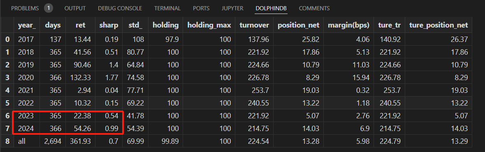
*图注：Factor 1 *

*图注：Factor 1 *

### Factor 2
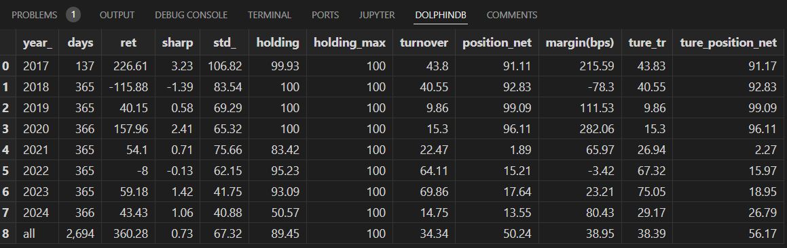
*图注：Factor 2 *

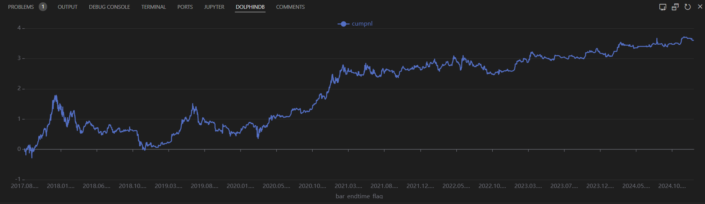
*图注：Factor 2 *

### Factor 3
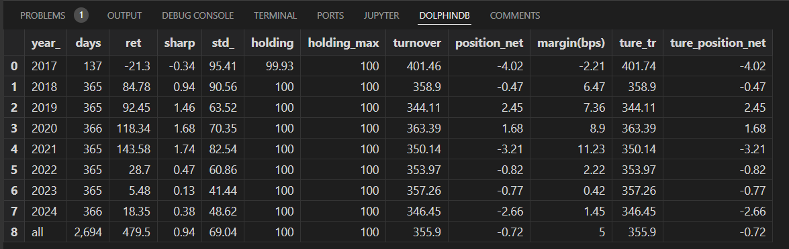
*图注：Factor 3 *

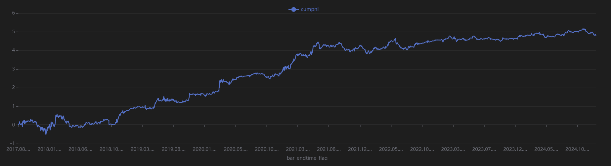
*图注：Factor 3 *

### Factor 4
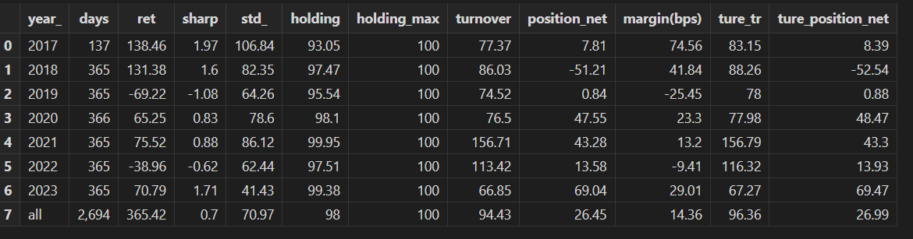
*图注：Factor 4 *

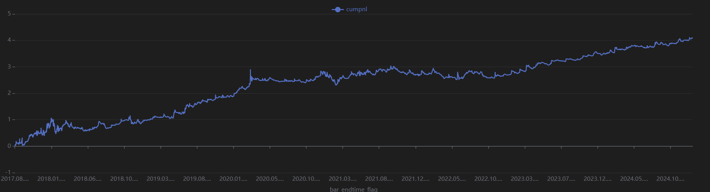
*图注：Factor 4 *

### Factor 5
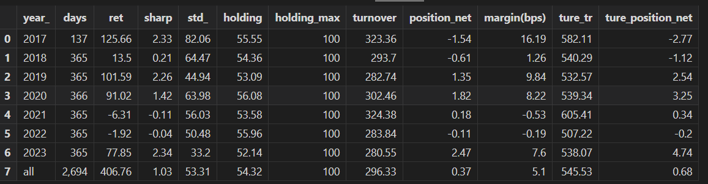
*图注：Factor 5 *

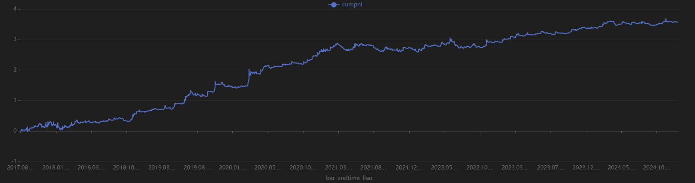
*图注：Factor 5 *

### Factor 6
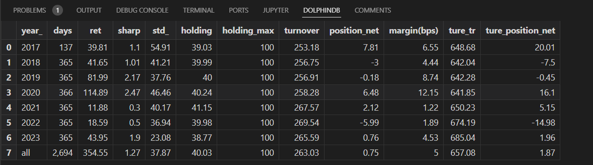
*图注：Factor 6 *

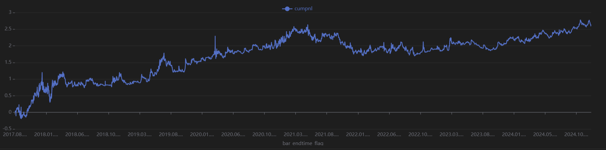
*图注：Factor 6 *

### Factor 7
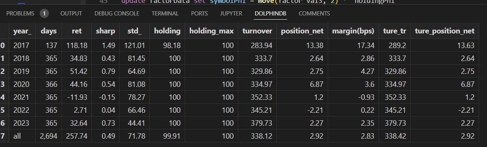
*图注：Factor 7 *

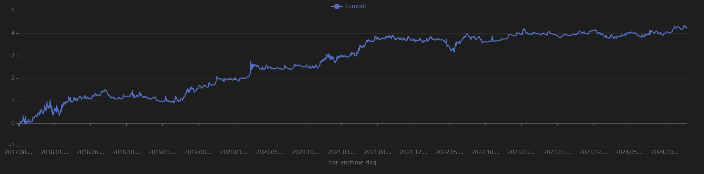
*图注：Factor 7 *

### Factor 8

*图注：Factor 8 *

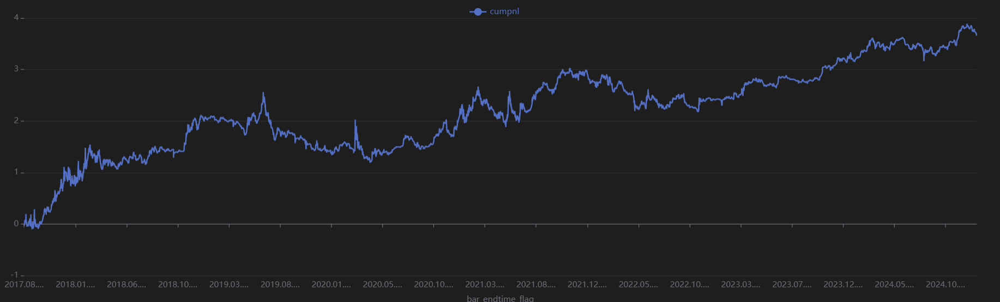
*图注：Factor 8 *

## 因子筛选与组合策略构建

### 因子筛选
根据因子间的相关性矩阵表现，我们选取了相关性低于0.5的五个因子进行后续的深入分析和策略组合。这有助于构建一个更多样化、信号冗余度较低的多因子模型。

**选定的五个因子及其类别如下：**
* **Factor1 (波动类):** 振幅差异因子
* **Factor2 (趋势类):** BIAS偏离度因子
* **Factor4 (动量类):** 12小时动量因子
* **Factor5 (趋势反转类):** RSI修正因子
* **Factor8 (成交量类):** 增强版VWAP因子

### 数据划分
为了进行模型训练和效果评估，数据被划分为样本内（In-Sample）和样本外（Out-of-Sample）两部分：
* **样本内数据：** 2017年01月 - 2021年12月
* **样本外数据：** 2022年01月 - 2024年12月 

### 多因子组合策略
最终，将筛选出的五个因子策略进行合并。合并方式基于每个因子独立生成调仓逻辑，然后在投资组合层面进行资金分配。具体而言，每个因子生成的策略在组合中的最大持仓（Max Holding）上限均设置为10%-40%。
具体的权重设置如下：factor_val_1 = factor_val1 * 0.2 + factor_val2 * 0.2 + factor_val4 * 0.10 + factor_val8 * 0.10 + factor_val5 * 0.4

得到的结果如下：
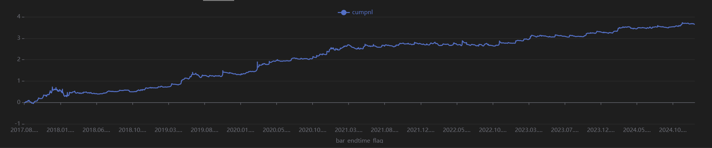
*多因子组合结果 *

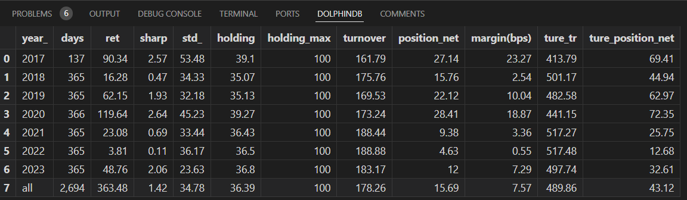
*多因子组合结果 *

图片形成了一条平稳的曲线，由于因子的相关性不高，多因子组合将风险分散，回撤减小，夏普有所提高。

### 后续改进方向

1、对策略添加止盈止损。
如：移动止盈，技术指标（布林带 rsi、ema结合使用进行动态止损）、波动率止损（std和atr、计算下行波动率）、斐波那契数列止盈等

2、对因子进行优化
如：对各因子的回看期、窗口期进行调整，将其运用于不同频率对比、与用更高频率进行聚合得到的结果进行对比等。
