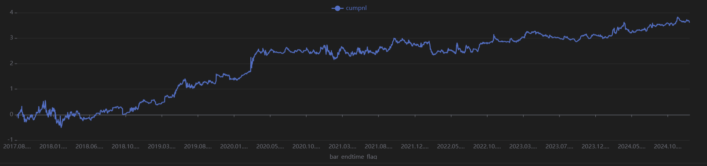
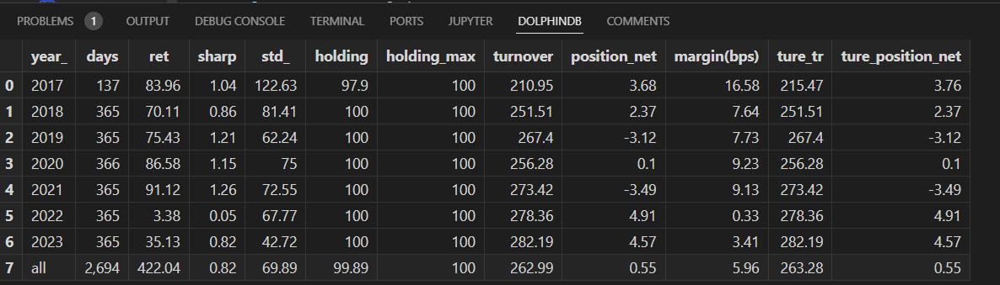

# BTC多因子择时策略

## 项目概览

本项目旨在构建并分析一系列经过工程化处理的量化交易因子，这些因子涵盖了市场趋势、动量、波动率以及成交量等多个维度。所有因子均经过动态标准化处理，使其更适用于高频交易场景下的多因子投资组合构建。项目共包含8个核心因子。

**作者：** 尹美珊 (学号：224040173)
**数据源：** 加密货币全品种（以币安平台BTC数据进行择时分析）

## 数据说明与预处理

### 数据来源与特征
* **数据下载平台：** 币安 (Binance)
* **交易品种：** 比特币 (BTC) 单品种择时分析
* **数据频率：** 1小时 (1h)
* **时间区间：** 2017年 - 2024年

### 数据预处理方法
1.  **空值处理：** 缺失值统一填补为0。这种处理方式的依据是：因子值的缺失多数情况下是由于计算基于移动窗口，导致回看期数据量不足。在此情况下，将缺失值视为中性信号（即不调仓），填充为0是相对合理的选择。
2.  **异常值过滤：** 采用3σ原则（三倍标准差）剔除数据集中的离群点，以减少极端异常值对因子表现和模型稳定性的影响。
3.  **同步校验：** 确保所有用于分析的加密货币品种（尽管本项目主要聚焦BTC）在时间戳上严格对齐，避免因时间不同步导致的数据分析偏差。

## 因子工程与分类解析

本项目共构建了八个量化因子，这些因子被归纳为四大类别：趋势类、动量类、波动率类和成交量类。

**关于趋势类与动量类因子的划分：**
将趋势类因子与动量类因子分开进行考察，是基于对因子间相关性矩阵的分析结果。通常而言，趋势投资策略侧重于跟随已经确认的市场方向，而动量投资策略则可能更关注价格变动的速度和强度。

### 一、趋势类因子 (Trend Factors)

| 因子编号 | 因子名称       | 核心逻辑                                                                 |
| :------- | :------------- | :----------------------------------------------------------------------- |
| Factor1  | 振幅差异因子   | 计算高收盘价（排序后）前25%交易日与后25%交易日的平均振幅之差，旨在捕捉极端行情下的波动特征。 |
| Factor2  | BIAS偏离度因子 | 衡量当前价格与其简单移动平均线（SMA）的相对位置，用以反映短期趋势的强度和可能的反转信号。   |
| Factor5  | RSI修正因子    | 对传统相对强弱指标（RSI）进行改进，将其值域标准化至\[-50, 50]区间，特别强化了对多头信号的识别能力。 |

### 二、动量类因子 (Momentum Factors)

| 因子编号 | 因子名称         | 核心逻辑                                                                       |
| :------- | :--------------- | :----------------------------------------------------------------------------- |
| Factor3  | MACD标准化因子   | 基于常用的12周期EMA、26周期EMA和9周期EMA构建的MACD指标，对其柱状图（Histogram）进行标准化处理，以捕捉中期趋势的动能变化。 |
| Factor4  | 12小时动量因子   | 计算120周期（对应12小时）的动量指标，并对其进行64周期的标准化处理，目的是突出短期价格趋势的持续性。        |
| Factor6  | 蜘蛛网策略因子   | 综合评估多个不同周期的指数移动平均线（EMA）的排列形态（多头/空头排列）并进行评分，结合当前价格在通道中的位置进行加权，用以识别通道突破的交易机会。 |

### 三、波动率类因子 (Volatility Factors)

| 因子编号 | 因子名称       | 核心逻辑                                                                       |
| :------- | :------------- | :----------------------------------------------------------------------------- |
| Factor7  | 网格交易因子   | 利用平均真实波幅（ATR）构建动态的网格交易通道，其因子得分结合了当前价格在网格中的位置以及波动率的调整，并进行标准化处理。 |

### 四、成交量类因子 (Volume Factors)

| 因子编号 | 因子名称       | 核心逻辑                                                                   |
| :------- | :------------- | :------------------------------------------------------------------------- |
| Factor8  | 增强版VWAP因子 | 一个复合型成交量加权平均价格（VWAP）指标，融合了典型价格VWAP、成交量趋势分析、价格偏离度以及价格变动的加速度等多个维度。 |

## 8个因子表现图示

### Factor 1

*图注：Factor 1 *

*图注：Factor 1 *

### Factor 2

*图注：Factor 2 *

*图注：Factor 2 *

### Factor 3

*图注：Factor 3 *

*图注：Factor 3 *

### Factor 4

*图注：Factor 4 *

*图注：Factor 4 *

### Factor 5

*图注：Factor 5 *

*图注：Factor 5 *

### Factor 6

*图注：Factor 6 *

*图注：Factor 6 *

### Factor 7

*图注：Factor 7 *

*图注：Factor 7 *

### Factor 8

*图注：Factor 8 *

*图注：Factor 8 *

## 因子筛选与组合策略构建

### 因子筛选
根据因子间的相关性矩阵表现，我们选取了相关性低于0.5的五个因子进行后续的深入分析和策略组合。这有助于构建一个更多样化、信号冗余度较低的多因子模型。

**选定的五个因子及其类别如下：**
* **Factor1 (波动类):** 振幅差异因子
* **Factor2 (趋势类):** BIAS偏离度因子
* **Factor4 (动量类):** 12小时动量因子
* **Factor5 (趋势反转类):** RSI修正因子
* **Factor8 (成交量类):** 增强版VWAP因子

### 数据划分
为了进行模型训练和效果评估，数据被划分为样本内（In-Sample）和样本外（Out-of-Sample）两部分：
* **样本内数据：** 2017年01月 - 2021年12月
* **样本外数据：** 2022年01月 - 2024年12月 

### 多因子组合策略
最终，将筛选出的五个因子策略进行合并。合并方式基于每个因子独立生成调仓逻辑，然后在投资组合层面进行等权重资金分配。具体而言，每个因子生成的策略在组合中的最大持仓（Max Holding）上限均设置为20%。
由于时间有限，后续补充这部分代码。（2025.05.15-2.25.05.16）
